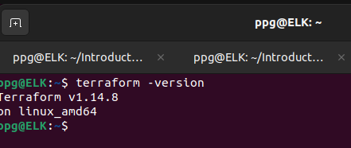
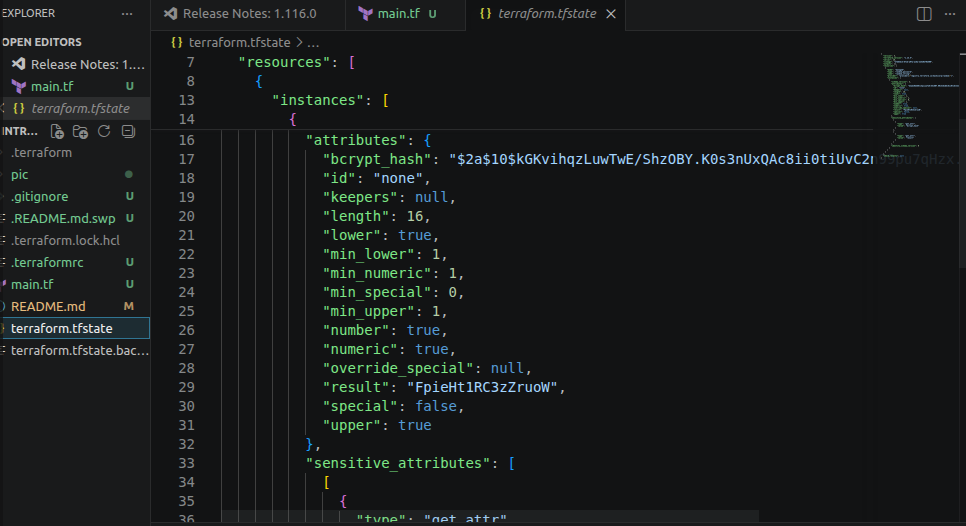
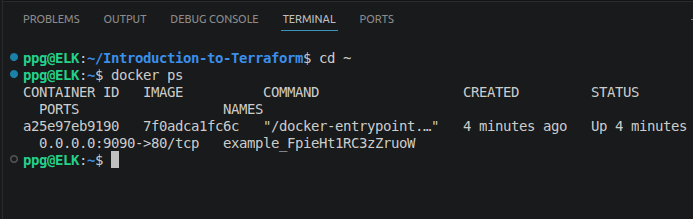
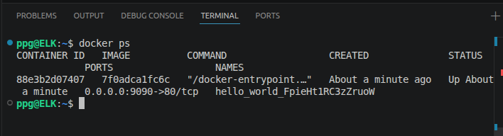
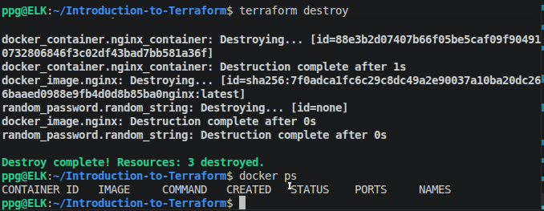
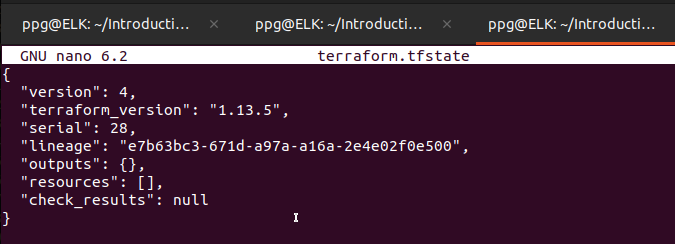

# Домашнее задание к занятию «Введение в Terraform» - Петр Петров
### Задание 1.

1.   

2. **Изучите файл .gitignore. В каком terraform-файле, согласно этому .gitignore, допустимо сохранить личную, секретную информацию?(логины,пароли,ключи,токены итд)**  

 **Ответ**  
Секретную информацию допустимо хранить в файле: `personal.auto.tfvars`  
Terraform автоматически подхватывает файлы с расширением .auto.tfvars без необходимости явно указывать их в команде, при этом файл легко исключить из репозитория через .gitignore — так секреты (пароли, токены, ключи и т. д.) остаются только на локальной машине или в защищённой среде CI/CD, отделяясь от кода инфраструктуры и минимизируя риск утечки.  

3. **Выполните код проекта. Найдите в state-файле секретное содержимое созданного ресурса random_password, пришлите в качестве ответа конкретный ключ и его значение.**  
 **Ответ**  
 "result": "FpieHt1RC3zZruoW"  
  

4. **Раскомментируйте блок кода, примерно расположенный на строчках 29–42 файла main.tf. Выполните команду terraform validate. Объясните, в чём заключаются намеренно допущенные ошибки. Исправьте их.**  
**Ответ**  

- 

 ``` Error: Missing name for resource
│ 
│   on main.tf line 21, in resource "docker_image":
│   21: resource "docker_image" {
│ 
│ All resource blocks must have 2 labels (type, name). 
```

Ошибка возникает из‑за того, что в блоке resource "docker_image" { не указано имя (идентификатор) ресурса — после типа ресурса (docker_image) обязательно должно идти второе значение в кавычках.   

- 

```Error: Invalid resource name
│ 
│   on main.tf line 26, in resource "docker_container" "1nginx":
│   26: resource "docker_container" "1nginx" {
│ 
│ A name must start with a letter or underscore and may contain only letters, digits,
│ underscores, and dashes.
```

Проблема в имени ресурса "1nginx": оно начинается с цифры, что нарушает правила именования в Terraform. Согласно спецификации, имя ресурса должно начинаться с буквы (a–z, A–Z) или символа подчёркивания (_)  

- 

``` Error: Reference to undeclared resource
│ 
│   on main.tf line 28, in resource "docker_container" "nginx_container":
│   28:   name  = "example_${random_password.random_string_FAKE.resulT}"
│ 
│ A managed resource "random_password" "random_string_FAKE" has not been declared in the root
│ module.
```


Ошибка была в том, что в коде указали неверное имя ресурса random_string_FAKE вместо random_string и допустили опечатку в атрибуте resulT вместо result.  

5. **Выполните код. В качестве ответа приложите: исправленный фрагмент кода и вывод команды docker ps**  

**Ответ**  

`resource "docker_image" "nginx" {`


```
resource "docker_container" "nginx_container" {
  image = docker_image.nginx.image_id
  name  = "example_${random_password.random_string.result}"
```

  

6. **Замените имя docker-контейнера в блоке кода на hello_world. Не перепутайте имя контейнера и имя образа. Мы всё ещё продолжаем использовать name = "nginx:latest". Выполните команду terraform apply -auto-approve. Объясните своими словами, в чём может быть опасность применения ключа -auto-approve. Догадайтесь или нагуглите зачем может пригодиться данный ключ? В качестве ответа дополнительно приложите вывод команды docker ps.**  

**Ответ**  
Использование ключа -auto-approve в Terraform сопряжено со значительными рисками из-за автоматического применения изменений без предварительного подтверждения пользователем, что может привести к необратимым последствиям, таким как случайное удаление критически важных баз данных или виртуальных машин. Отсутствие этапа ручной проверки плана выполнения (terraform plan) лишает возможности вовремя обнаружить опечатки или логические ошибки в конфигурации, лишает администратора контроля над масштабом операций и создает прямую угрозу потери данных в рабочей среде, делая процесс развертывания инфраструктуры менее безопасным.  

Ключ -auto-approve может пригодиться в автоматизированных средах, когда процесс полностью управляется CI/CD-пайплайнами вроде GitHub Actions, GitLab CI или Jenkins, изменения заранее протестированы и проверены, предусмотрены резервные копии и механизмы отката, требуется максимально быстрая реакция, например в сценариях автомасштабирования, либо выполняется одноразовая инициализация инфраструктуры, где план действий уже известен и заранее одобрен.  

  

7. **Уничтожьте созданные ресурсы с помощью terraform. Убедитесь, что все ресурсы удалены. Приложите содержимое файла terraform.tfstate**  

**Ответ**  

  

  

8. **Объясните, почему при этом не был удалён docker-образ nginx:latest. Ответ ОБЯЗАТЕЛЬНО НАЙДИТЕ В ПРЕДОСТАВЛЕННОМ КОДЕ, а затем ОБЯЗАТЕЛЬНО ПОДКРЕПИТЕ строчкой из документации terraform провайдера docker. (ищите в классификаторе resource docker_image )**  

**Ответ**  
Образ nginx:latest не был удален потому что в предоставленном коде для ресурса образа docker_image используется специфический аргумент, который управляет его жизненным циклом при уничтожении инфраструктуры. В блоке кода это выглядит следующим образом:

```
resource "docker_image" "nginx" {
  name         = "nginx:latest"
  keep_locally = true
}

```
Причина кроется в параметре keep_locally = true. Когда этот флаг установлен в значение true, Terraform удаляет запись об образе из своего файла состояния (state-файла), но не дает команду Docker-демону физически удалить слои образа из локального хранилища на вашем компьютере  
cтрочка из документации:  

> keep_locally (Boolean) If true, then the Docker image won't be deleted on destroy operation. If this is false, it will delete the image from the docker local storage on destroy operation.

